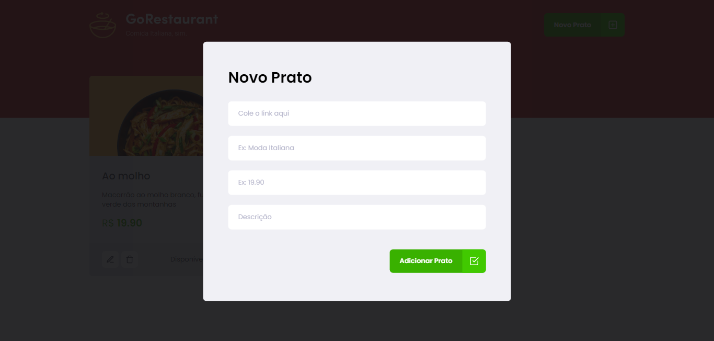

<h1 align="center">
  
</h1>

 

## 📌 | About this project

GoRestaurant is a solution for restaurants that want to display their menu online. The panel for adding a new dish is for someone with admin permission.

 

## 🚀 | What technologies that I used?

- [React.js](https://pt-br.reactjs.org/)
- [TypeScript](https://www.typescriptlang.org/)
- [Yup](https://www.npmjs.com/package/yup)

I used too styled-components, unform, axios... and more

 

## 💻 | Layout

The layout is simple but responsive and beautiful. Mainly thought of accessibility..

 

  
  

Developed with ❤️ by [Vinicius de Souto](https://github.com/soutovnc)
